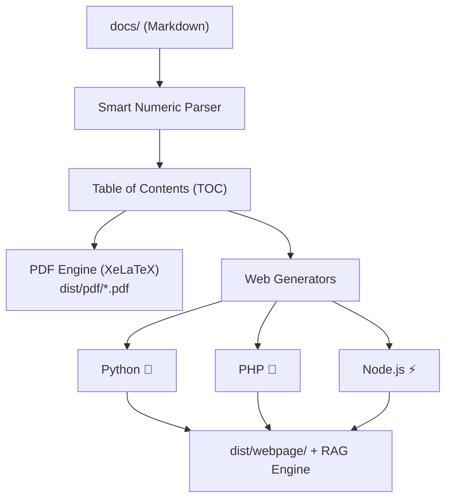
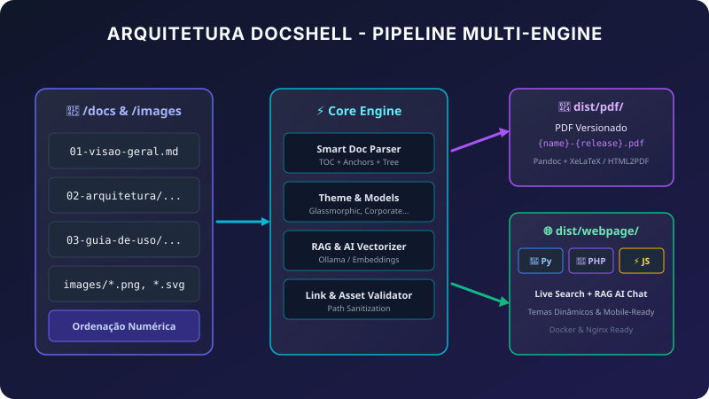

<div align="center">
  
  <h1>🐚 GlassHub DocShell</h1>
  <p><em>Intelligent Documentation Engine & Architectural Framework for the GlassHub Ecosystem</em></p>

  <p>
    <a href="https://github.com/matheustheus27/GlassHubDocShell"></a>
    
    
    
  </p>
</div>

> **Unified, modern, decoupled platform for generating technical documentation in versioned PDF and interactive Websites across multiple runtimes (Python, PHP, JavaScript) with semantic search, RAG/AI assistant, Docker support, and customizable visual themes.**

---

## 📑 Table of Contents

- [Overview & Architecture](#-overview--architecture)
- [Key Features](#-key-features)
- [Project Directory Structure](#-project-directory-structure)
- [Prerequisites & Installation](#-prerequisites--installation)
- [CLI Quickstart Guide](#-cli-quickstart-guide)
  - [Taskfile Commands (Recommended)](#taskfile-commands-recommended)
  - [Makefile Commands (Alternative)](#makefile-commands-alternative)
- [Document Structuring Guide (`docs/`)](#-document-structuring-guide-docs)
- [Images & Visual Assets (`images/`)](#-images--visual-assets-images)
- [Themes & Visual Models (`models/`)](#-themes--visual-models-models)
- [Publication Settings (`publication/`)](#-publication-settings-publication)
- [RAG & AI Assistant](#-rag--ai-assistant)
- [Docker & Container Orchestration](#-docker--container-orchestration)
- [License](#-license)

---

## 🔭 Overview & Architecture

**GlassHub DocShell** transforms Markdown files organized in the `docs/` folder into publication-grade deliverables:
1. **Executive & Versioned PDF Document** (`dist/pdf/{basename}-{release}.pdf`) using Pandoc and XeLaTeX.
2. **Modern Interactive Website** (`dist/webpage/`) with real-time search filtering, dynamic sidebar, responsive typography, and an **embedded AI Assistant Chatbot powered by RAG (Ollama / Llama 3.2)**.




---

## ✨ Key Features

- 🔢 **Smart Reader & Natural Numeric Ordering**: Recursively scans `docs/` directories and files based on their leading numbers (`00-`, `01-`, `02-`), automatically generating section hierarchies and page order.
- 🎯 **Functional Table of Contents & Real-Time ScrollSpy**: Automatically builds navigable TOCs with clickable anchor links (`#section-slug`) and real-time active section highlighting as you scroll.
- 🌐 **3 Web Documentation Runtimes (`-l / --lang`)**: Generate and serve the website using **Python**, **PHP**, or **JavaScript (Node.js)** via simple CLI flags.
- 🏛️ **Clean Tripartite Output Separation**: Generates build output strictly separated into `dist/webpage/frontend/` (Static UI), `dist/webpage/backend/` (FastAPI / RAG API), and `dist/webpage/worker/` (Dedicated Translation Worker).
- 🎨 **Selectable Design Models (`-m / --model`)**:
  - `Glassmorphic` *(Default)*: Translucent frosted glass effect (*backdrop-filter: blur*), indigo/cyan modern gradients, and refined dark mode.
  - `Corporate`: Clean navy blue and slate palette designed for formal reports and governance.
  - `Modern-Dark`: High-contrast deep obsidian theme tailored for developers and API specs.
  - `Minimal`: Distraction-free Swiss typography focused on fast reading.
- 🤖 **Interactive AI Assistant (WebSocket Streaming & RAG)**: Floating chatbot with LLaMA 3.2, live chunk-based citation badges, and chat history saved in localStorage with a trash action (`🗑️`).
- 🌐 **On-Demand Translation Worker (TranslateGemma + RabbitMQ)**: Background translation service orchestrated with RabbitMQ (3 retries, backoff, 180s deadline, DLQ), multi-tiered Redis/SQLite caching, logical block chunking (`split_markdown_into_blocks`), and a non-intrusive minimizable floating chip (`🔄 45%`).
- 📊 **Datadog APM & DogStatsD Observability**: Unified telemetry across all 8 containers with audit report export via `task report`.
- 🐳 **Smart Docker Compose Profiles**: Run isolated profiles (`task docker:python`, `task docker:php`, `task docker:node`) all mapped to port `8000`.

---

## 📁 Project Directory Structure

```text
DocShell/
├── 📁 docs/                        # Markdown documents with numeric ordering
│   ├── 📄 00-capa.md
│   ├── 📄 01-visao-geral.md
│   ├── 📁 02-arquitetura/
│   │   ├── 📄 01-principios.md
│   │   └── 📄 02-componentes.md
│   ├── 📁 03-guia-de-uso/
│   ├── 📁 04-ia-e-rag/
│   ├── 📁 05-docker/
│   └── 📄 99-conclusao.md
├── 🖼️ images/                      # Project image assets (*.svg, *.png, *.jpg)
├── 🎨 models/                      # Visual themes and templates
│   ├── 📁 glassmorphic/            # Glassmorphism Theme (Default)
│   ├── 📁 corporate/               # Corporate Theme
│   ├── 📁 modern-dark/             # Modern Dark Theme
│   └── 📁 minimal/                 # Minimalist Theme
├── ⚙️ publication/                 # Publication configuration
│   ├── 📄 publication.yml          # Metadata, author, colors, release, etc.
│   └── 📁 templates/               # Base LaTeX and HTML templates
├── 🛠️ scripts/                     # Atomic Component Architecture
│   ├── 📁 core/                    # Core engines (parser, config, validator, RAG, PDF, datadog)
│   │   ├── 🐍 doc_parser.py        # Numeric parser and TOC builder
│   │   ├── 🐍 config_loader.py     # YAML configuration loader
│   │   ├── 🐍 link_validator.py    # Link and image validator
│   │   ├── 🐍 rag_engine.py        # Semantic search and RAG engine
│   │   ├── 🐍 datadog_reporter.py  # Telemetry audit and Markdown report exporter
│   │   └── 🐍 pdf_engine.py        # PDF compiler engine
│   ├── 📁 rag/                     # RAG Microservice & Routers
│   │   ├── 📁 routers/             # FastAPI routers (chat, ws_chat, docs, health)
│   │   └── 📁 services/            # Translation worker, Ollama client, Redis cache
│   ├── 📁 worker/                  # Dedicated Task Worker
│   │   └── 🐍 worker.py            # RabbitMQ AMQP translation consumer
│   ├── 📁 generators/              # Web generators per language runtime
│   │   ├── 🐍 python/              # Python generator and server
│   │   ├── 🐘 php/                 # PHP generator and server
│   │   └── ⚡ javascript/          # Node.js generator and server
│   ├── 📁 cli/                     # Automation scripts per OS
│   │   ├── 🪟 windows/             # PowerShell scripts (generate-site.ps1, etc.)
│   │   └── 🐧 linux/               # Bash scripts (generate-site.sh, etc.)
│   ├── 🐳 docker/                  # Dockerfiles and container configurations
│   └── 📄 requirements.txt         # Python dependencies
├── 📦 dist/                        # Build output artifacts
│   ├── 📕 pdf/                     # Compiled versioned PDF ({basename}-{release}.pdf)
│   ├── 📊 reports/                 # Datadog telemetry audit reports (datadog_report.md)
│   └── 🌐 webpage/                 # Modular Web Deliverables
│       ├── 📁 frontend/            # Static HTML, styles, scripts, search index
│       ├── 📁 backend/             # FastAPI RAG API Gateway
│       └── 📁 worker/              # Dedicated translation task worker
├── 📋 Taskfile.yml                 # Cross-platform task automation (Task)
├── 🔨 Makefile                     # GNU Make automation
├── 🐳 docker-compose.yml           # Multi-service container orchestration with profiles
├── 📖 README.md                    # Project guide
└── ⚖️ LICENSE                      # Non-commercial permissive license
```

---

## 🛠️ Prerequisites & Installation

### Automated Installation (Recommended)

Run the automated installer to download and configure all compilers, runtimes, and dependencies:

```bash
# Windows / Linux / macOS
task install
```
*(or `make install` on Linux/macOS)*

### Manual Prerequisites

| Tool | Purpose | Windows Installation | Linux Installation (Ubuntu/Debian) |
|---|---|---|---|
| **Taskfile** | CLI Automation | `winget install Task.Task` | `sh -c "$(curl --location https://taskfile.dev/install.sh)" -- -d` |
| **Python** | Runtime & Parser | `winget install Python.Python.3.12` | `sudo apt install python3 python3-pip` |
| **Pandoc & MiKTeX/XeLaTeX** | PDF Compilation | `winget install JohnMacFarlane.Pandoc MiKTeX.MiKTeX` | `sudo apt install pandoc texlive-xetex` |
| **Node.js** (Optional) | JS Runtime | `winget install OpenJS.NodeJS` | `sudo apt install nodejs npm` |
| **PHP** (Optional) | PHP Runtime | `winget install PHP.PHP.8.3` | `sudo apt install php php-cli` |
| **Docker** | Containerization | `winget install Docker.DockerDesktop` | `sudo apt install docker.io docker-compose` |

---

## 🚀 CLI Quickstart Guide

### Taskfile Commands (Recommended)

| Command | Description | Example |
|---|---|---|
| `task install` | Downloads and installs all runtimes, PDF compilers, and libraries | `task install` |
| `task site` | Generates Web documentation using default runtime and theme | `task site` |
| `task site -- -l <Lang>` | Generates site specifying runtime language (`Py`, `PHP`, `JS`) | `task site -- -l "PHP"` |
| `task site -- -m <Model>` | Generates site specifying visual theme model | `task site -- -m "Corporate"` |
| `task site -- -l <Lang> -m <Model>` | Combines language runtime and theme model | `task site -- -l "JS" -m "Glassmorphic"` |
| `task pdf` | Compiles the versioned PDF document | `task pdf` |
| `task pdf -- -m <Model>` | Compiles PDF with specified theme model | `task pdf -- -m "Corporate"` |
| `task docs` | Runs documentation build pipeline (validate + doc + pdf + site) | `task docs` |
| `task build` | Runs full pipeline & starts containers (supports `-l`, `-m`, `--all`) | `task build -- -l "PHP" -m "Corporate"` |
| `task serve` | Starts local documentation server with AI/RAG on port 8000 | `task serve` |
| `task serve -- -l <Lang> -p <Port>` | Starts server with custom runtime and port | `task serve -- -l "PHP" -p 8080` |
| `task docker:python` | Starts Python stack in Docker on port 8000 | `task docker:python` |
| `task docker:php` | Starts PHP stack in Docker on port 8000 | `task docker:php` |
| `task docker:node` | Starts Node.js stack in Docker on port 8000 | `task docker:node` |
| `task report` | Generates and exports Datadog telemetry & container audit report | `task report` |
| `task validate` | Validates internal markdown links and image assets | `task validate` |
| `task clean` | Removes build directories (`dist/`) and temporary files | `task clean` |

---

### Makefile Commands (Alternative)

```bash
# Install dependencies
make install

# Web generation
make site LANG=py MODEL=glassmorphic
make site LANG=php MODEL=corporate
make site LANG=js MODEL=modern-dark

# PDF compilation
make pdf MODEL=corporate

# Complete build & deploy pipeline
make build
make build LANG=php MODEL=corporate
make build ALL=1

# Local server
make serve LANG=py PORT=8000

# Docker stacks by profile
make docker-python
make docker-php
make docker-node
make docker-down

# Datadog telemetry report
make report

# Validation & Cleanup
make validate
make clean
```

---

## 📖 Document Structuring Guide (`docs/`)

Place all your `.md` files in the `docs/` directory. The parser uses natural numeric sorting:

```text
📁 docs/
├── 📄 00-capa.md             # 1st document (Cover)
├── 📄 01-visao-geral.md      # 2nd document
├── 📁 02-arquitetura/        # Creates Section "Arquitetura"
│   ├── 📄 01-principios.md   # Subsection 2.1
│   └── 📄 02-componentes.md  # Subsection 2.2
├── 📁 03-guia-de-uso/        # Creates Section "Guia De Uso"
│   ├── 📄 01-instalacao.md   # Subsection 3.1
│   └── 📄 02-comandos-cli.md # Subsection 3.2
└── 📄 99-conclusao.md        # Final document
```

### Frontmatter Metadata (Optional)

You can add YAML metadata to the top of any document:

```markdown
---
title: "Custom Document Title"
description: "Brief summary of this section"
---

# Document Heading...
```

---

## 🖼️ Images & Visual Assets (`images/`)

1. Add your image files (`.png`, `.svg`, `.jpg`, `.webp`) to the `images/` directory.
2. Reference images inside Markdown using standard syntax:
   ```markdown
   
   ```
3. DocShell automatically normalizes paths so images resolve properly in both compiled PDFs and the web dist output (`dist/webpage/images/`).

---

## 🎨 Themes & Visual Models (`models/`)

Themes are located in `models/<model-name>/`:

| Theme | Key Features | Best Used For |
|---|---|---|
| **`glassmorphic`** | Frosted glass (*blur*), indigo/cyan gradients, Outfit/Inter typography | Modern developer portals, tech platforms |
| **`corporate`** | Navy blue and slate palette, structured layout | Executive reports, governance, audits |
| **`modern-dark`** | Deep obsidian background, high contrast, JetBrains Mono | API references, engineering docs |
| **`minimal`** | Clean monochrome typography, distraction-free | Formal specifications, rapid reading |

---

## ⚙️ Publication Settings (`publication/`)

Customize metadata and document parameters in `publication/publication.yml`:

```yaml
document:
  title: "DocShell - Technical Documentation"
  subtitle: "Architecture and Engineering Guide"
  author: "Matheus Ferreira"
  version: "1.0.0"
  release: "v1.0"
  output:
    pdf:
      basename: "DocShell-Technical-Documentation"
      directory: "dist/pdf"
    website:
      directory: "dist/webpage"
      default_runtime: "python"
      port: 8000

theme:
  default_model: "glassmorphic"

ai_assistant:
  enabled: true
  provider: "ollama"
  ollama:
    host: "http://127.0.0.1:11434"
    chat_model: "llama3.2"
    embed_model: "nomic-embed-text"
    translate_model: "translategemma"
```

---

## 🤖 RAG, Streaming & On-Demand Translation

DocShell integrates a complete microservice layer for documentation intelligence:
1. **Semantic Search & Real-Time RAG**: All Markdown documents are indexed into semantic chunks (`search_index.json`). The chatbot connects over **WebSocket streaming** (`/api/ws/chat`), answering queries in real time with interactive citation badges.
2. **Chat History Persistence**: Chat sessions persist across reloads via browser storage with a trash action (`🗑️`).
3. **Dedicated Translation Worker & RabbitMQ**: Background translation runs via RabbitMQ message broker with DLQ and 3 retries.
4. **TranslateGemma Chunking**: Long documents are automatically sliced into logical blocks (`split_markdown_into_blocks`) and reassembled so translation is 100% complete without token cutoff.
5. **Minimizable Progress Chip**: While translation runs, a small floating chip (`🔄 45%`) keeps users updated without obstructing reading.

---

## 🐳 Docker & Container Orchestration

Run isolated container stacks per runtime, all unified on port **8000**:

```bash
# Start Python stack (Nginx + FastAPI + Worker + MongoDB + RabbitMQ + Redis + Ollama + Datadog)
task docker:python

# Start PHP stack (PHP-FPM/Nginx + Redis + Ollama + Datadog)
task docker:php

# Start Node.js stack (Express + Redis + Ollama + Datadog)
task docker:node

# View live container logs
task docker:logs

# Generate Datadog telemetry & audit report
task report

# Stop all containers
task docker:down
```

| Service | Port | Image | Purpose |
|---|---|---|---|
| **`docshell-web`** | `8000` | Nginx Alpine | Web frontend and reverse proxy |
| **`docshell-rag`** | `8080` | FastAPI Python 3.12 | API gateway, WebSocket streaming and RAG |
| **`docshell-worker`** | - | Python 3.12 Worker | Background translation via TranslateGemma |
| **`docshell-mongo`** | `27017` | MongoDB 7.0 | Document database & telemetry store (persisted in `mongo_data`) |
| **`docshell-rabbitmq`** | `5672`/`15672` | RabbitMQ Management | Message broker & queue orchestration |
| **`docshell-redis`** | `6379` | Redis 7 Alpine | In-memory cache for translations and embeddings |
| **`docshell-ollama`** | `11434` | Ollama | Local LLM inference (LLaMA 3.2, TranslateGemma, Nomic) |
| **`docshell-datadog`** | `8125`/`8126` | Datadog Agent 7 | APM tracing, DogStatsD metrics, and container logs |

---

## 📜 License

This project is licensed under the **Non-Commercial License**.

- ✅ **Allowed:** Personal, academic, research, copying, modification, and internal organization use.
- ❌ **Prohibited:** Commercial sale, commercial licensing, or direct commercial exploitation of this software or its derivative works.

See the [LICENSE](/LICENSE) file for the full legal terms.
