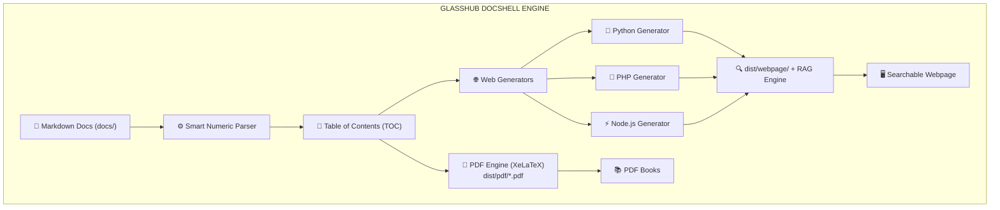

# Visão Geral do Sistema

O **GlassHub DocShell** foi projetado para resolver a complexidade de manter documentações sincronizadas, profissionais e facilmente consumíveis por diferentes perfis de usuários (engenheiros, gestores, clientes e novos integrantes de equipe).

## Principais Recursos

1. **Ordenação Numérica Automática**:
   Ao organizar os arquivos em pastas como `01-introducao.md`, `02-arquitetura/01-visao.md`, o motor identifica a sequência numérica e monta automaticamente a árvore de navegação e o sumário (TOC).

2. **Sumário Funcional e ScrollSpy Ativo**:
   Tanto na versão PDF quanto no Website, o sumário gerado contém âncoras funcionais diretas para cada seção e subseção, com destaque visual em tempo real da seção em leitura (ScrollSpy).

3. **Múltiplos Runtimes Web (-l / --lang) e Estrutura Modular Tripartida**:
   Geração e execução em **Python**, **PHP** ou **JavaScript (Node.js)**, organizando o resultado de forma limpa em:
   - `dist/webpage/frontend/`: Assets estáticos, HTML e índice de busca.
   - `dist/webpage/backend/`: API Gateway FastAPI com suporte a streaming WebSocket e RAG.
   - `dist/webpage/worker/`: Worker dedicado para processamento de tarefas em background.

4. **Modelos de Design Selecionáveis (-m / --model)**:
   Temas pré-configurados:
   - **Glassmorphic**: Visual refinado com vidro fosco (*frosted glass*), gradientes e efeito blur integrados ao **GlassHub Engine**.
   - **Corporate**: Estilo sóbrio, executivo e estruturado.
   - **Modern-Dark**: Visual escuro de alto contraste voltado para desenvolvedores.
   - **Minimal**: Foco em leitura limpa e ultrarrápida.

5. **IA Generativa, RAG e Tradução On-Demand**:
   - **Chat IA com Streaming WebSocket**: Chatbot integrado com LLM local (Ollama / LLaMA 3.2), deep links para a documentação e persistência de histórico no navegador com botão de limpeza (`🗑️`).
   - **Tradução Inteligente On-Demand (TranslateGemma)**: Tradução em background orquestrada por fila RabbitMQ (com 3 retries e deadline de 180s) e cache multi-nível (Redis e SQLite).
   - **Chip Flutuante Minimizável**: Widget de progresso que pode ser minimizado em uma pílula flutuante (`🔄 45%`) para não atrapalhar a navegação do usuário.

6. **Observabilidade e Telemetria Datadog**:
   Monitoramento de APM, DogStatsD e logs estruturados em todos os contêineres, com geração de relatórios de auditoria unificados via `task report`.
