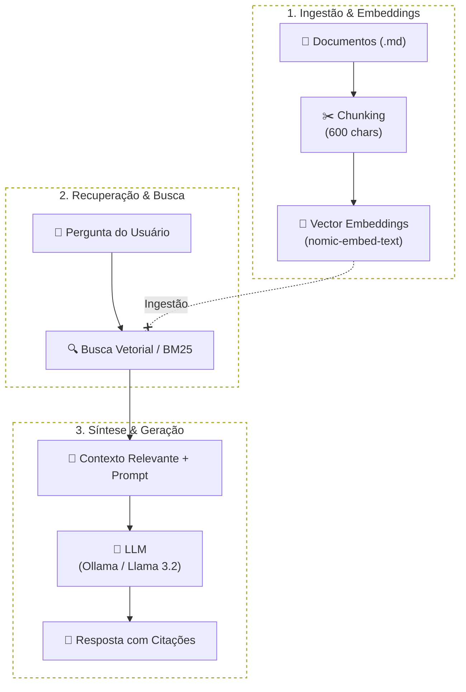

# Inteligência Artificial e RAG

<p>
  
  
  
</p>

O **GlassHub DocShell** possui um assistente de IA integrado diretamente nas páginas da documentação web através do padrão **RAG (Retrieval-Augmented Generation)**.

## Arquitetura do RAG



## Como Usar o Assistente no Site

1. Ao abrir qualquer versão do site (`http://localhost:8000`), clique no botão flutuante **"Assistente IA"** no canto inferior direito.
2. Digite sua pergunta em linguagem natural (ex: *"Como funciona a ordenação numérica dos arquivos no DocShell?"*).
3. O assistente consultará o índice da documentação e fornecerá a resposta sintetizada via streaming WebSocket em tempo real, acompanhada de badges clicáveis com links diretos para as seções de onde a informação foi extraída.
4. **Persistência de Histórico**: As conversas ficam salvas no armazenamento local do navegador e só são reiniciadas se o usuário clicar no botão de lixeira (`🗑️`).

---

## 🌐 Tradução Dinâmica On-Demand (TranslateGemma)

O DocShell possui um pipeline de internacionalização inteligente:
1. Ao trocar o idioma no seletor do cabeçalho (ex: `en-US`, `es-ES`, `fr-FR`), o frontend verifica se a tradução completa já existe em cache (Redis ou SQLite).
2. Caso ainda não exista, a requisição é enfileirada no **RabbitMQ** para o **`docshell-worker`**.
3. O worker processa os documentos utilizando o modelo **`TranslateGemma`** no Ollama, dividindo textos extensos em blocos lógicos (`split_markdown_into_blocks`) para garantir 100% de integridade sem cortes de texto.
4. Enquanto a tradução ocorre em segundo plano, um **Chip Flutuante Minimizável** no canto inferior esquerdo exibe o progresso em tempo real (`🔄 en-US (45%)`), permitindo que o leitor continue navegando sem obstruções.

---

## Configuração do Provedor de IA

Em `publication/publication.yml`, você pode personalizar os modelos utilizados:

```yaml
ai_assistant:
  enabled: true
  provider: "ollama"
  ollama:
    host: "http://127.0.0.1:11434"
    chat_model: "llama3.2"
    embed_model: "nomic-embed-text"
    translate_model: "translategemma"
```
